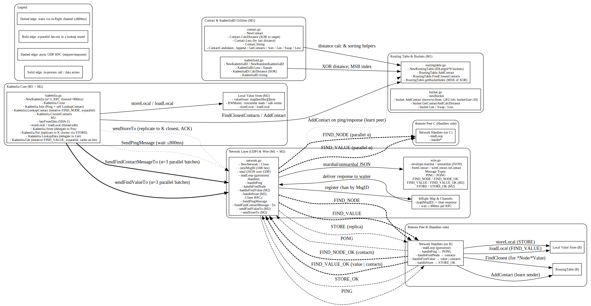

# d7024e – CLI User Guide (M1–M3)

* **M1:** network formation (ping, join, node lookup)
* **M2:** value distribution (put/get)
* **M3:** command-line interface (this guide)

---

## Architecture Diagram




## 1) Prerequisites

* **Go** installed (1.21+ recommended).
* This repository checked out locally.
* Run commands from the **repo root**:
  `C:\Users\<you>\Downloads\D7024E\d7024e` (Windows)
  or `~/D7024E/d7024e` (macOS/Linux).

> If you use PowerShell on Windows, mind the examples labeled “PowerShell”. Bash/zsh users can copy the *macOS/Linux* snippets.

---

## 2) Building / Running the CLI

The CLI runner lives at:
`labs/kademlia/cmd/cli/main.go`

### Option A: run directly

**Windows (PowerShell):**

```powershell
cd \d7024e\labs\kademlia\cmd\cli

# Terminal 1 – start a node that listens on 127.0.0.1:9001
go run . -addr 127.0.0.1:9001

# Terminal 2 – start another node and bootstrap to the first
go run . -addr 127.0.0.1:9002 -bootstrap 127.0.0.1:9001
```

**macOS/Linux (bash/zsh):**

```bash
cd ~/D7024E/d7024e

# Terminal 1
go run ./labs/kademlia/cmd/cli -addr 127.0.0.1:9001

# Terminal 2
go run ./labs/kademlia/cmd/cli -addr 127.0.0.1:9002 -bootstrap 127.0.0.1:9001
```

### Option B: build a reusable binary

```bash
# from repo root
go build -o kcli ./labs/kademlia/cmd/cli

# then
./kcli -addr 127.0.0.1:9001
./kcli -addr 127.0.0.1:9002 -bootstrap 127.0.0.1:9001
```

You should see a banner like:

```
node up: id=<40-hex> addr=127.0.0.1:9001
commands: put <text> | get <40-hex-key> | exit
```

---

## 3) CLI Commands (what to type, what to expect)

The CLI supports **three** commands:

### `put <text>`

* **What it does:** hashes `<text>` with SHA-1 to produce a **40-hex key**, stores the value **locally**, and **replicates** it to the **K closest** nodes to that key.
* **What you see:** the **key** printed on its own line (exactly 40 hex chars).
* **Example:**

  ```
  put hello world
  ```

  Output:

  ```
  2aae6c35c94fcfb415dbe95f408b9ce91ee846ed
  ```

### `get <40-hex-key>`

* **What it does:** tries to fetch the value by key. If not local, performs an iterative **FIND\_VALUE** lookup. On success, **prints the value** and the node it came **from**, then **caches** it locally.

* **What you see:** the **value** on one line and a `from <addr>` line.

* **Example (in another terminal/node):**

  ```
  get 2aae6c35c94fcfb415dbe95f408b9ce91ee846ed
  ```

  Output:

  ```
  hello world
  from 127.0.0.1:9002
  ```

* **If not found:** prints `NOTFOUND`.

### `exit`

* **What it does:** terminates the CLI/node.
* **What you see:** no output; the process exits cleanly.

---

## 4) What happens under the hood (short tour)

### When you start a node

* The node binds a UDP socket at `-addr` and starts the network read loop.
* If `-bootstrap` is provided (and differs from your `-addr`):

  * Sends a **PING** to learn/refresh routing info.
  * Performs a lookup to warm the routing table (so queries have useful peers).

### On `put <text>`

1. Compute the **key** = SHA-1(`<text>`) → 20 bytes (printed as 40-hex).
2. **Store locally** immediately (origin keeps a copy).
3. Perform a **node lookup** for that **key** to find the **K closest** peers.
4. Send **STORE** RPC to those peers (replication).

### On `get <key>`

1. Check local store. If hit → return immediately.
2. Otherwise, perform **FIND\_VALUE** iterative lookup.

   * If a peer returns a **value**, stop early and return it.
   * Cache the value **locally** (helps future reads).
3. If no peer has it → print `NOTFOUND`.

---

## 5) Single-node and multi-node demos

### Single node (everything local)

```bash
go run ./labs/kademlia/cmd/cli -addr 127.0.0.1:9001
# In the CLI:
put lorem ipsum
# copy key
get <that-key>     # still works (local)
exit
```

### Two nodes (replication and remote fetch)

* Node A:

  ```bash
  go run . -addr 127.0.0.1:9001
  ```
* Node B:

  ```bash
  go run . -addr 127.0.0.1:9002 -bootstrap 127.0.0.1:9001
  ```
* In **Node B** CLI:

  ```
  put distributed systems are fun
  ```

  Copy the key.
* In **Node A** CLI:

  ```
  get <that-key>
  ```

  You should see:

  ```
  distributed systems are fun
  from 127.0.0.1:9002
  ```

---

## 6) Flags (node startup)

* `-addr <host:port>`
  UDP listen address for this node. Example: `-addr 127.0.0.1:9001`
* `-bootstrap <host:port>` *(optional)*
  Another node to join. Example: `-bootstrap 127.0.0.1:9001`
* `-id <40-hex>` *(optional)*
  Force a specific node ID (otherwise a random ID is used).

> IDs are 160-bit (20 bytes), shown as 40-char hex.

**Values only get placed on the “responsible” nodes at *put time***. If a node didn’t exist (or wasn’t known) then, it won’t magically have those values later. And your `get` walks toward the nodes **closest (by XOR) to the key**, not “whoever might have it.” So after you bring up B, some of A’s old keys won’t be discoverable from B unless you re-publish them.

* **A put values before B existed.** At that moment A only knew itself, so replication placed the value **on A only** (origin always keeps a copy; it can’t send to peers it doesn’t know).
* Later if **bootstrapped B to A** and tried `get` from B for A’s earlier keys.
  The `get` does a Kademlia lookup toward the nodes **closest to the key** (by XOR distance). If A isn’t among those “K closest” from B’s point of view, B won’t even ask A, so you get `NOTFOUND`.

Why one direction works but not the other:

* Key from **B → A succeeds**: when we `put` on B (after bootstrap), B’s replication sends to the K closest—**A was in that set**, so A got a replica. Then `get` on A works (A even serves it locally, hence `from 127.0.0.1:9001`).
* Key from **A → B fails** (for your “Aditya” key): when A stored it, B didn’t exist, so only A had it. After B joins, the lookup from B heads toward nodes closest to that key—**and for that specific key, B is closer than A**, so the search doesn’t hit A and returns `NOTFOUND`.

### So, will B be able to fetch values A put **before** bootstrap?

* **Not guaranteed.** It only works if A happens to be among the K closest to that key (so B’s lookup reaches A). Otherwise you’ll see `NOTFOUND`.
* The lab code (sensibly) doesn’t do background **republish/refresh**, so old values don’t move to the now-responsible nodes after the network changes.

That’s the whole story: **placement is decided at publish time; lookup is proximity-driven.** If we publish while alone, the data is marooned until we republish (or the implementation has periodic republish/refresh, which it doesn’t).

---

## 7) Capabilities
**What you can do**

* Start multiple nodes on localhost, join them, and form a Kademlia network.
* `put` arbitrary **text** and get back its content-address (SHA-1) key.
* `get` by key from any node; see which peer served it.
* Values automatically **replicate** to K closest nodes on `put`.
* Values fetched via `get` are **cached locally**.

---

## 8) Tips, gotchas, troubleshooting

* **“flag provided but not defined: -addr”**
  You passed flags to `go run` instead of your program. Correct usage:

  ```powershell
  go run ./labs/kademlia/cmd/cli -addr 127.0.0.1:9001
  #             ^ package path first, then flags
  ```

* **“directory not found … labs\kademlia\labs\kademlia”**
  You were already in `labs/kademlia` and doubled the path. From repo root, use:

  ```powershell
  go run ./labs/kademlia/cmd/cli -addr 127.0.0.1:9001
  ```

  From the CLI folder itself, use:

  ```powershell
  cd labs\kademlia\cmd\cli
  go run . -addr 127.0.0.1:9001
  ```

* **Nothing happens on `get`**
  Make sure the node where you ran `put` is still running and that the second node was started with a **valid** `-bootstrap` that points to the first node.

* **Whitespace in `put`**
  Everything after `put` is treated as raw content (including spaces).
  Example: `put   hello   spaced   world` is valid.

* **NOTFOUND**
  Means no peer among the queried set had the value (or the origin died before replication and no cache exists yet).

---

## 9) Reference: what the CLI maps to (internals)

* `put <text>`
  → `Kademlia.Put([]byte(text))`
  → `storeLocal` (origin) + **find K closest** + **STORE** RPCs to those peers.

* `get <key>`
  → `Kademlia.Get(key)`
  → `loadLocal` check → **FIND\_VALUE** iterative lookup → **cache** (storeLocal) → print `from <addr>`.

* `exit`
  → triggers the provided quit function and terminates the process.

You don’t need to call these functions directly—the CLI does it for you.

---

## 10) Non-interactive (piped) usage

Useful for scripts:

**Windows (PowerShell):**

```powershell
"put hello via pipe`nexit`n" | go run ./labs/kademlia/cmd/cli -addr 127.0.0.1:9001
```

**macOS/Linux:**

```bash
printf "put hello via pipe\nexit\n" | go run ./labs/kademlia/cmd/cli -addr 127.0.0.1:9001
```

---

## 11) Where to look in the code

* `labs/kademlia/cli.go` — the CLI wrapper (parses `put/get/exit`, prints results).
* `labs/kademlia/kademlia.go` — `Put`, `Get`, local store/cache.
* `labs/kademlia/network.go` — UDP messaging, PING/PONG, STORE, FIND\_VALUE.
* `labs/kademlia/routingtable.go` — routing logic, closest K selection.
* `labs/kademlia/m1_network_test.go`, `m2_value_test.go`, `m3_cli_test.go` — tests that define and validate behavior.

---
